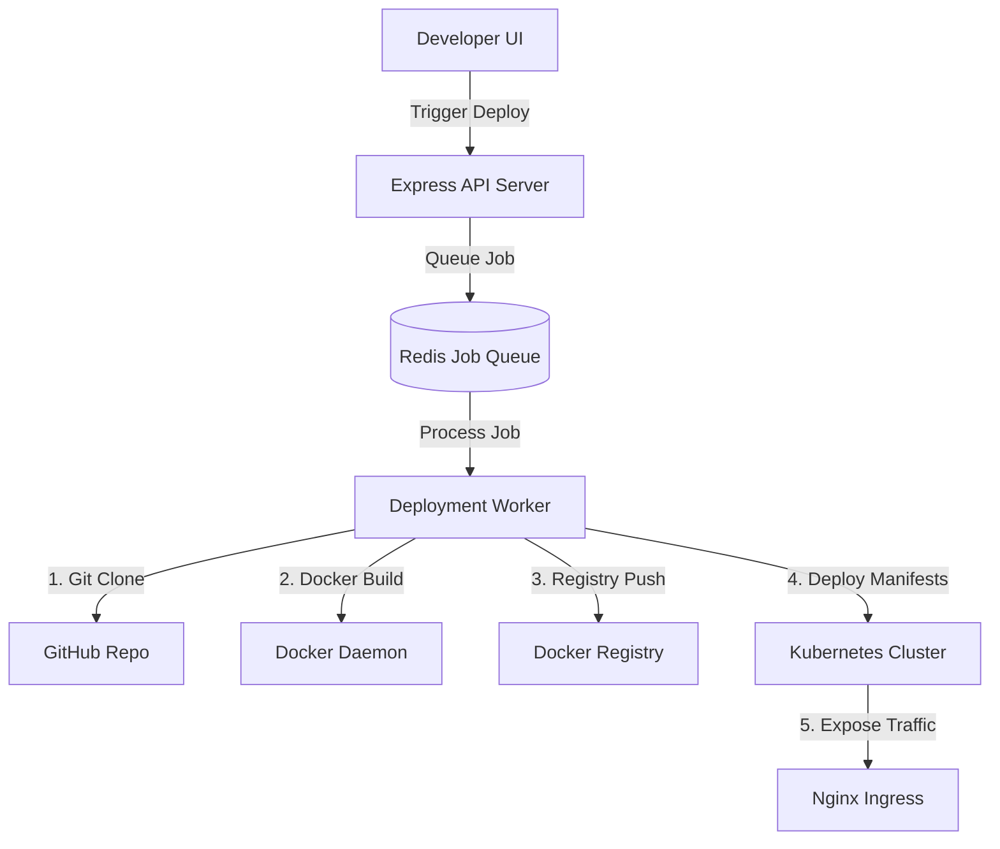

# CloudDeploy PaaS — Production Deployment Guide

This guide details how to configure and run **real, non-simulated** application deployments on the CloudDeploy platform.

By default, the platform runs in a **simulated developer mode** if it cannot connect to the local Docker Daemon or a Kubernetes cluster. To perform high-fidelity, production-grade deployments, follow the steps below.

---

## 🏗️ Architecture Overview

The CloudDeploy orchestrator uses a job queue (`BullMQ`) to handle deployments asynchronously:



---

## 📋 Prerequisites

To run real deployments, ensure the following services are active on your host system:

### 1. Docker Daemon
* Ensure **Docker Desktop** or **Docker Engine** is running.
* Verify connectivity by running the following command in your terminal:
  ```powershell
  docker ps
  ```
  If it returns a list of active containers, the daemon is ready.

### 2. Kubernetes Cluster
* You can use **Minikube**, **Docker Desktop Kubernetes**, **kind**, or a cloud provider (GKE, EKS, AKS).
* Ensure your local terminal is pointed to the correct cluster context:
  ```powershell
  kubectl cluster-info
  ```
* **Ingress Controller:** The platform automatically configures an Nginx Ingress. Install the Nginx ingress controller in your cluster:
  ```powershell
  # For Minikube:
  minikube addons enable ingress
  
  # For Docker Desktop / Standard K8s:
  kubectl apply -f https://raw.githubusercontent.com/kubernetes/ingress-nginx/main/deploy/static/provider/cloud/deploy.yaml
  ```

### 3. Redis Database (v5.0+)
* Required for the BullMQ background deployment worker.
* Ensure your Redis server is running (currently configured on port `6380` in `backend/.env`).

### 4. MongoDB Database
* Required for project metadata, user sessions, and logs.
* Ensure MongoDB is running (currently configured on port `27017` in `backend/.env`).

---

## ⚙️ Configuration Setup

Configure your credentials in `backend/.env` to authenticate with your Docker Registry and configure your base domain name.

### 1. Registry Credentials (`backend/.env`)
Provide valid credentials so the worker can push built images and Kubernetes can pull them:
```env
# Change this to your registry if not using Docker Hub (e.g. ghcr.io, ECR)
DOCKER_REGISTRY=docker.io
DOCKER_USERNAME=your_dockerhub_username
DOCKER_PASSWORD=your_dockerhub_access_token_or_password
```

### 2. Kubernetes Image Pull Secret
Create a secret named `registry-credentials` in your target namespace (or the namespace prefix namespace) to let Kubernetes pull private images:
```powershell
kubectl create secret docker-registry registry-credentials `
  --docker-server=https://index.docker.io/v1/ `
  --docker-username="your_dockerhub_username" `
  --docker-password="your_dockerhub_access_token_or_password" `
  --docker-email="your_email@example.com"
```

### 3. Local Domain Configuration (`backend/.env`)
By default, Ingress URLs are generated as `<project-slug>.<BASE_DOMAIN>`.

#### Option A: Wildcard DNS via nip.io (Recommended)
This bypasses editing your hosts file entirely by using a free wildcard DNS resolver:
1. Retrieve your local Kubernetes / Minikube IP address:
   ```powershell
   minikube ip
   # Example output: 192.168.49.2
   ```
2. Configure `BASE_DOMAIN` in `backend/.env` using the IP and the `.nip.io` suffix:
   ```env
   BASE_DOMAIN=192.168.49.2.nip.io
   ```
This automatically routes `mini-railway-demo.192.168.49.2.nip.io` directly to your local Kubernetes cluster's ingress controller.

#### Option B: Manual Hosts File Mapping
If you choose to keep `BASE_DOMAIN=clouddeploy.local`, you must manually append IP mappings to your hosts file (`C:\Windows\System32\drivers\etc\hosts` on Windows):
```text
192.168.49.2   mini-railway-demo.clouddeploy.local
```

---

## 🚀 Step-by-Step Deployment Flow

Once prerequisites and configurations are ready, you can deploy any application:

### Step 1: Create a Project
1. Log in to the CloudDeploy Command Center.
2. Click **Create Project** or **New Project**.
3. Input your repository info:
   - **Name:** E.g., `My Node App` (slug will be auto-generated as `my-node-app`).
   - **GitHub Repository URL:** Must be an HTTPS link (e.g. `https://github.com/static-web-apps/vanilla-basic`).
   - **Default Branch:** E.g. `main` or `master`.
   - **Container Port:** The port your application code listens on (e.g. `3000` or `80`).

### Step 2: Prepare the Application Repository
Ensure your repository has a valid **Dockerfile** at the root. Example for a Node app:
```dockerfile
FROM node:18-alpine
WORKDIR /app
COPY package*.json ./
RUN npm ci
COPY . .
EXPOSE 3000
CMD ["node", "server.js"]
```
Also, ensure your application has a GET `/health` endpoint returning `200 OK`. This is used by the Kubernetes Liveness and Readiness probes to monitor your app's health.

### Step 3: Trigger a Deployment
1. Open the project card on the dashboard and click **View**.
2. Navigate to the **Deployments** tab.
3. Click **Trigger Deploy**.
4. The system will:
   - Queue a new build job.
   - Clone/pull your repository to `./backend/repos/<project-slug>`.
   - Build the Docker image.
   - Push the image to your registry.
   - Apply Kubernetes manifests (`Namespace`, `Deployment`, `Service`, `Ingress`, `HorizontalPodAutoscaler`).
   - Monitor rollout progress.

### Step 4: Verify App Health
* Once the deployment status turns **Running**, click the generated **Live URL** to access your live web application!
* Check CPU and Memory resource graphs in the **Overview** tab.
* Toggle the **Environment** tab to manage environment variables (synced automatically to Kubernetes ConfigMaps and Secrets).
